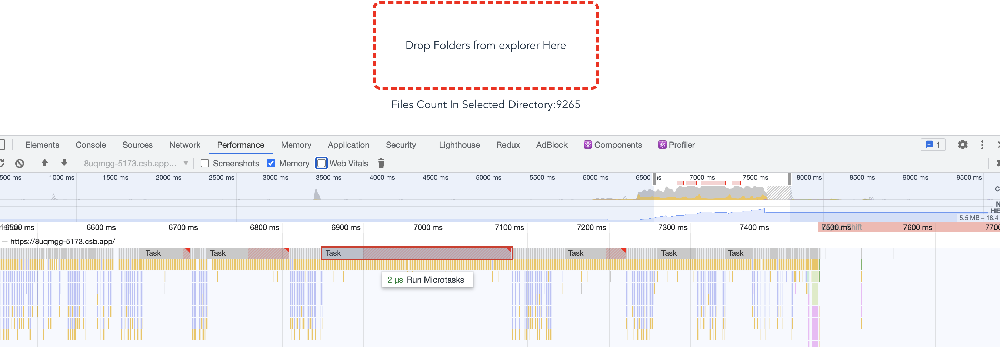

## Context

As a part of the exercise i was wondering - “is it possible to attach all files for particular folder?”. And here is a blog post how it was achieved.

> *TLDR: Yes it is possible. Scroll to the end of the article to see full example.*
>

## Part 1. Input component

Let’s design `<input />` component to add support DND(drag and drop) support, since folder uploader works only with DND functionality.

```tsx

export type Props = {
 onFilesSelect: (files: File[]) => void;
};

export default function FileUploader({onFilesSelect}: Props){
 // Drag'n Drop
 const handleDrop = () => {};

 return (
    <div
      id="dropzone"
      onDragEnter={handleDrop}
      onDragOver={handleDrop}
      onDrop={handleDrop}
    >
      <div id="boxtitle">
        Drop Folders from explorer Here
      </div>
    </div>
  );
}
```

Add Some Styles:

```css
#dropzone {
  text-align: center;
  width: 300px;
  height: 100px;
  margin: 10px;
  padding: 10px;
  border: 4px dashed red;
  border-radius: 10px;
}

#boxtitle {
  display: table-cell;
  vertical-align: middle;
  text-align: center;
  width: 300px;
  height: 100px;
}
```

Stylish result will be looks like this 💅:


Result of the component

## Part 2. DND handler

As you may see in previous part - we left `handleDrop` empty. Now we put some code and see the results:

```tsx
const handleDrop = (e:React.DragEvent<HTMLInputElement>) => {
 // stop default behavior 
  e.preventDefault();
  e.stopPropagation();

  if(e.type !== 'drop' || e.type !== 'dragend') {
    // if unexpected event - return empty files array
    return [];
  }
  const items = e.dataTransfer.items;
  return Promise.all(
          Array.from(items).map(async (item) => {
            const entry = item.webkitGetAsEntry();
            if (!entry) { return []; }
      // transform File Or Directory - to File[]
      const files = await scanFiles(entry);
      return files;
      })
     ).then(files => {
      // call prop with file results.
      onFilesSelect(files);
     });

}
```

## Part 3. Directory Reader

To convert files - we ‘ll write `scanFiles` function. It’s returns `Promise` since  `Reader.readEntries` returns callback. Also, this function will be recursive, since when we read the directory - we should call a reader to get all files/folders inside.

> ⚠️ **[From MDN](https://developer.mozilla.org/en-US/docs/Web/API/DataTransferItem/webkitGetAsEntry#javascript).** **Note:** To read all files in a directory, `readEntries` needs to be called repeatedly until it returns an empty array. In Chromium-based browsers, the following example will only return a max of 100 entries.

> ⚠️ **[webkitGetAsEntry](https://developer.mozilla.org/en-US/docs/Web/API/DataTransferItem/webkitGetAsEntry)** API has no official W3C or WHATWG specification. It will works only in chromium-based browsers.

```tsx
export default async function scanFiles(
item: FileSystemEntry | FileSystemDirectoryEntry | FileSystemFileEntry,
  files: File[] = []): Promise<File[]> {
 if (item.isFile) {
  // return an array of files
    return [...files, await scanFile(item)];
  }
 else if (item.isDirectory) {
  // create a reader
    const directoryReader = (item as FileSystemDirectoryEntry).createReader();
    // make readEntries as a promise
  const res = await new Promise<File[]>((resolve, reject) => {
      directoryReader.readEntries(async (entries) => {
   // read direactories
        const result = await Promise.all(
          entries.map(async (entry) => await scanFiles(entry, files))
        );
        // NOTE: result will contains only first 100 elements, so me make a hack
    // we recall readEntries again and get more results.
    // NOTE 2: this hack allows you to get an 100^100 results?
        directoryReader.readEntries(async (entries) => {
          const result2 = await Promise.all(
            entries.map(async (entry) => await scanFiles(entry, files))
          );
     // NOTE 3: merge 2 arrays
          resolve([...result.flat(), ...result2.flat()]);
        }, reject);
      }, reject);
    });
    return res;
  }
 // typescript was thoughts that this code is reachable.  
  throw new Error("Unknown Error");
}
// file handler
async function scanFile(item: FileSystemEntry): Promise<File> {
  const file = await new Promise<File>((resolve, reject) => {
    (item as FileSystemFileEntry).file(
      (fileResult) => {
        resolve(fileResult);
      },
      (error) => {
        reject(error);
      }
    );
  });
  return file;
}
```

Let me explain this piece of sh*t line by line.

1. If item is file - return file (as array)
2. if item is directory:
    1. create a `directoryReader`.
    2. create a `Promise`.
        1. call `readEntries` and for each entry call `scanFiles` recursively.
        2. call `directoryReader.readEntries` once again. Since `readEntries` returns only first 100 elements, but folders can contains more than 100 files.
        3. resolve the promise with all collected entries. (I do `flat()` call since File handler also returns array.)
    3. Return Promise result.

## Performance

Performance can be slow since we doesn’t know about how many items inside directories (if items less than 100 - performance is good enough.) But the problem is - when folder contains thousands of files like in screenshot below



9k items - 9k function calls as a microtask.

## Thoughts

- It’s better to use `iterator` instead of `Promise` with full result. It helps with performance issue.
- Maybe WASM module will be better but not sure about support of the FS system - need to research.

Have a good day 👋. See you soon!
