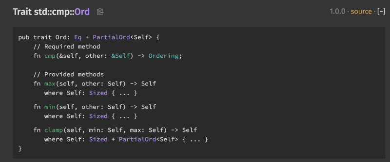

## The Problem

At the previous article I was described my new package distributed via npm - `@rslike/std` - standard JS library which allows to remove undefined behavior in your code. But today, std is not a part of our story.

## The Solution

Today, I'm gonna show you comparison package(`@rslike/cmp`). Using this package you can compare your classes and(or) objects like a pro.

How to install:

```bash
npm install @rslike/cmp
# or via yarn
yarn add @rslike/cmp
# or via pnpm
pnpm add @rslike/cmp
```

I highly recommend to install `@rslike/std` package too, since if you would like to implement PartialEq - you need to use Option from `@rslike/std` package

Usage:

```ts title="node.ts" showLineNumbers caption="example of usage"
import {type Ord, Ordering} from '@rslike/cmp'

import { None, Option, Some } from '@rslike/std';

class Node implements Ord {
  left: Node | null;
  right: Node | null;

  constructor(readonly value: number) {
    this.value = value;
  }
  partialEquals(other: unknown): boolean {
    return this.value == Number(other);
  }
  notEquals(other: unknown): boolean {
    return !this.partialEquals(other);
  }
  partialCompare(other: unknown): Option<Ordering> {
    const asNumber = Number(other);
    if (this.value === asNumber) {
      return Some(Ordering.Equal);
    } else if (this.value > asNumber) {
      return Some(Ordering.Greater);
    } else if (this.value < asNumber) {
      return Some(Ordering.Less);
    }
    return None()
  }
  lt(other: unknown): boolean {
    return this.compare(other).isLt();
  }
  le(other: unknown): boolean {
    return this.compare(other).isLe();
  }
  gt(other: unknown): boolean {
    return this.compare(other).isGt();
  }
  ge(other: unknown): boolean {
    return this.compare(other).isGe();
  }
  compare(other: unknown): Ordering {
    return this.partialCompare(other).unwrap();
  }
}
```

Easy, isn't it?

That's because I use the same(mostly inspired) types(traits) from [rustlang](https://doc.rust-lang.org/std/cmp/trait.Ord.html).



That's it for today. Check it out [`std`](https://www.npmjs.com/package/@rslike/std) package.

## UPD

P.S. I was release 2.x version since new package cmp was included and now here is 3 packages:

- [std](https://www.npmjs.com/package/@rslike/std)
- [cmp](https://www.npmjs.com/package/@rslike/cmp)
- [dbg](https://www.npmjs.com/package/@rslike/dbg)
