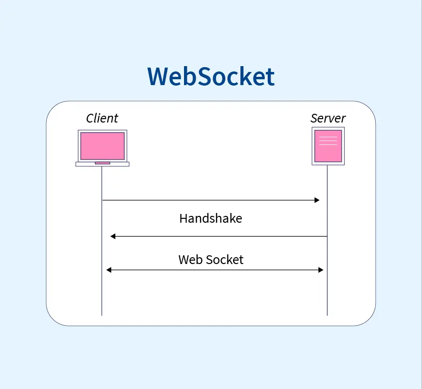

Hello, Today i'm gonna show you how to load test websockets using k6 tool.

## What is k6?

[Grafana k6](https://k6.io/docs#:~:text=What%20is%20k6%3F,performance%20regressions%20and%20problems%20earlier.) is an open-source load testing tool that makes performance testing easy and productive for engineering teams

## What is websockets?

WebSockets is a internet communication protocol between client and server.

unlike HTTP - websockets are bi-directional internet protocol, unlike HTTP it starts from `ws://` or `wss://`. It is a stateful protocol, which means the connection between client and server will keep alive until it is terminated by either party (client or server).


> Image 1. Websocket connection schema

## Where used websockets?

Websockets are very useful when you would like to show information in realtime. It can be chat application (like slack, teams or google chat) or weather app or Crypto Market(like Binance).

### Chrome Devtools

Chrome devtools protocol are also using websocket to communicate between different layers in bi-directional way.

Here is an example of communication in chrome devtools protocols. Where client is a `browser`(or what end-user see on the screen) and `server` - is a browser internals(like v8 - JS executor, html rendering, network, etc.)

### from client to server

- newTab(url?) - opens new tab with selected url(or default screen)
- newUrl(url) - change current tab URL and open it
- closeTab

etc.

### from server to client

- render HTML(with CSS styles)
- recalculate styles (e.g. when animation is triggers)
- call network request on the page
- JS parsing
- JS execution

etc.

## Application example

Before start testing - you need an app shich you will test in.

Let's assume that this application is already exists.

And you test API will be looks like this:

```txt
[POST] /account/login -> returns accessToken field

[GET] /account/ws/account -> returns `Websocket` upgrading connection and subscribes into account updates

[POST] /account/update -> updates user info
```

## Installing k6

from [official documentation](https://k6.io/docs/get-started/installation/): we need to install external binary file and install on your machine.

Since I'm using mac: just use [`homebrew`](https://brew.sh/) and it will looks like this:

```bash
brew install k6
```

## load test scenario

Let's write some scenario:

```js
// account.test.js
import ws from 'k6/ws'


// ESSENTIAL:
export default function(){}
```

Let's execute it by following command:

```bash
k6 account.test.js
```

And the report will be looks like screen below:

<!-- screenshot -->
