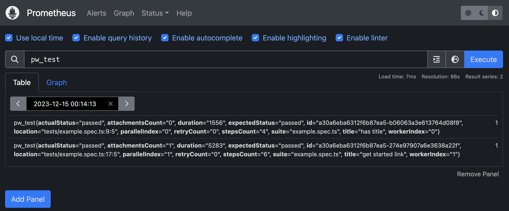

import FileTree from "@/components/FileTree/index.astro";

## What is a Playwright?

[Playwright](https://playwright.dev) is a test automation library from Microsoft. It is designed to test web applications across different browsers, providing a unified API to automate browsers like Chromium, Firefox, and WebKit

## Context

Our test automation framework is using [playwright](https://playwright.dev/docs/intro) as a test library and [allure testops](https://qameta.io/) as a reporter. But it collects only test metrics, like pass/fail scenarios, and shows attachments and stdin/out. But what happens with node.js while test scenarios have been executed? To answer this question we decided to collect deep metrics and export them to Prometheus because we already use it for showing k6 test metrics. After collecting these metrics to Prometheus it automatically bypasses [Grafana](https://grafana.com/). With Grafana we built some infographics about run.

## What is Prometheus?

[Prometheus](https://prometheus.io/) is a system monitoring and alerting toolkit. Prometheus is designed to collect metrics from various systems, store them, and enable querying and analysis of those metrics.

## What was implemented?

We implemented a [playwright reporter](https://github.com/vitalics/playwright-prometheus-remote-write-reporter) that pushes metrics directly from tests (or reporters) into the Prometheus instance.

## How you sends metrics?

TThe initial idea was to adopt the sources from [prometheus-remote-write](https://github.com/huksley/prometheus-remote-write).

Unfortunately, I have a few problems with it, so I decided to use the package, instead of adopting the source code.

We use [prometheus-remote-write](https://github.com/huksley/prometheus-remote-write) package to achieve the goal.

### Technical details

<FileTree title="Project Structure">
- src
  - **index.ts** - reporter implementation
  - **helper.ts** - exported runtime API
- package.json
</FileTree>

#### helper.ts

In `helper.ts` we export classes: `Counter` and `Gauge`.

`Counter` - is a structure which can be only increased

`Gauge` - same as Counter but can decrease and set the value

```ts title="helper.ts" showLineNumbers caption="metric example class"
abstract class Metric {
  protected series: PrometheusWriterTimeseries
  _getSeries() {
    return this.series
  }
}

export class Counter extends Metric {
  protected counter: number = 0
  inc(value){
    this.counter += value;
  }
}

export class Gauge extends Counter {
  set(value) {
    this.counter = value
  }
  dec(value){
    this.counter -= value
  }
}
```

`index.ts` file uses these metrics to collect on its own it's side

```ts title="example.ts" showLineNumbers caption="usage example"
import { Counter, Gauge } from './helper'

import {Reporter} from '@playwright/test'

export { Counter, Gauge }

export default class PrometheusReporter implements Reporter {
  private test = new Counter({
    name: 'test'
  }, 1) // always static, let it be 1
  constructor(options){
    this.options = options
  }
  private async send(timeseries: Timeseries | Timeseries[]){
    // send metrics to prometheus using options
  }
  async onTestEnd(test, result) {
    this.test.labels({
      title: test.title,
      id: test.id,
      // ...etc
    }).inc()

    await this.send(this.test._getSeries())

    this.test.reset() // new test, new counter
  }
}

```

## How to start?

Before installing the package you need to configure Prometheus.

- Enable remote-write feature. See what [`prometheus.yml`](https://github.com/vitalics/playwright-prometheus-remote-write-reporter/blob/main/example/prometheus.yml) we use.
- Start the docker container(or restart the remote instance) with the feature: `--enable-feature=remote-write-receiver`. See example from [`package.json`](https://github.com/vitalics/playwright-prometheus-remote-write-reporter/blob/main/example/package.json#L16)

Now you are ready to move further

### Install the package

```sh
npm i playwright-prometheus-remote-write-reporter # npm
yarn add playwright-prometheus-remote-write-reporter # yarn
pnpm add playwright-prometheus-remote-write-reporter # pnpm
bun a playwright-prometheus-remote-write-reporter # bun
```

### What metrics are collected by default?

By default, we collect node js internals stats and playwright-exposed metrics, like a project, test, annotations, test duration, etc.

Full list of collected metrics you may found [here](https://github.com/vitalics/playwright-prometheus-remote-write-reporter?tab=readme-ov-file#collected-metrics)

### Enable reporter

in your `playwight.config.ts` add next line

```ts title="playwight.config.ts" showLineNumbers caption="playwright config" {4}
export default defineConfig({
// ...
  reporter: [
    ['playwright-prometheus-remote-write-reporter', {
      // options object
    }]
  ],
// ...
})
```

## Use custom metrics

Apart from built-in metrics. We export `Counter` and `Gauge` classes to make custom metrics exportable

```ts title="example.test.ts" showLineNumbers caption="test example file using metrics" {2, 4-6, 10-12, 15-17, 21-22}
import { test } from '@playwright/test'
import { Counter } from 'playwright-prometheus-remote-write-reporter'

const gotoCounter = new Counter({
  name: 'url',
}, 0)

test('example test', async ({page}) => {
  await page.goto('http://example.com')
  gotoCounter.labels({
    url: 'http://example.com'
  }).inc() // 1

  await page.goto('https://playwright.dev')
  gotoCounter.labels({
    url: 'https://playwright.dev'
  }).inc() // 2
})

test.afterEach(() => {
  gotoCounter.collect() // send to prometheus
  gotoCounter.reset() // reset counter after each test
})
```

## Result

As you can see - now your metrics are exportable and ready to display in Grafana.


> Image 1. Result from package example

**Note 1**: Unfortunately, in my machine grafana cannot establish the connection to Prometheus. So you might see only the local Prometheus instance.

**Note 2**: During project limitation, I cannot show how it looks like in our self-hosted grafana

## Happy metric collection!

## Links

- [1]: https://github.com/vitalics/playwright-prometheus-remote-write-reporter - reporter
- [2]: https://www.npmjs.com/package/playwright-prometheus-remote-write-reporter - npm library
- [3]: https://playwright.dev- playwright
- [4]: https://qameta.io - allure testops
- [5]: https://prometheus.io - prometheus
- [6]: https://grafana.com - grafana
- [7]: https://github.com/huksley/prometheus-remote-write - prometheus remote write node.js library
