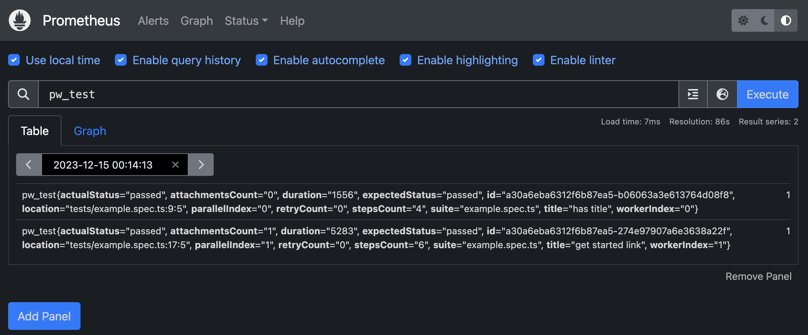

import FileTree from "../../components/FileTree.astro";

## What is Playwright?

Playwright is a test automation library from microsoft.
It is designed to test web applications across different browsers, providing a unified API to automate browsers like Chromium, Firefox, and WebKit

## Context

Our test automation framework is using [playwright](https://playwright.dev/docs/intro) as a test library and [allure testops](https://qameta.io/) as a reporter. But it collects only test metrics, like pass/fail scenarios, show attachments and stdin/out. But what happends with node.js while test scenarios has been executed? To answer this question we decide to collect deep metrics and export it to prometheus, because we already use it for showing k6 tests metrics. After collecting these metrics to prometheus it automatically bypass to [grafana](https://grafana.com/). With grafana we built some infografics about run.

## What is Prometheus?

[Prometheus](https://prometheus.io/) is a system monitoring and alerting toolkit. Prometheus is designed to collect metrics from various systems, store them, and enable querying and analysis of those metrics.

## What was implemented?

We was implemented [playwright reporter](https://github.com/vitalics/playwright-prometheus-remote-write-reporter) which push metrics directly from tests (or reporter) into prometheus instance.

### Technical deep

<FileTree title="Project Structure">
- src
  - **index.ts** - reporter implementation
  - **helper.ts** - exported runtime API
- package.json
</FileTree>

#### helper.ts

In `helper.ts` we export classes: `Counter` and `Gauge`.

`Counter` - is a structure which can be only increased

`Gauge` - same as Counter but can decrease and set the value

``` ts
// helper.ts

abstract class Metric {
  protected series: PrometheusWriterTimeseries
  _getSeries() {
    return this.series
  }
}

export class Counter extends Metric {
  protected counter: number = 0
  inc(value){
    this.counter += value;
  }
}

export class Gauge extends Counter {
  set(value) {
    this.counter = value
  }
  dec(value){
    this.counter -= value
  }
}
```

`index.ts` file use this metrics to collect on own it's side

``` ts
// index.ts
import { Counter, Gauge } from './helper'

import {Reporter} from '@playwright/test'

export { Counter, Gauge }

export default class PrometheusReporter implements Reporter {
  private test = new Counter({
    name: 'test'
  }, 0)
  constructor(options){
    this.options = options
  }
  async onTestEnd(test, result) {
    this.test.labels({
      title: test.title,
      id: test.id,
      // ...etc
    }).inc()

    await pushTimeseries(this.test._getSeries(), this.options)

    this.test.reset() // new test, new counter
  }
}

```

## How to start?

Before to install the package you need to configure prometheus.

- Enable remote-write feature. See what [`prometheus.yml`](https://github.com/vitalics/playwright-prometheus-remote-write-reporter/blob/main/example/prometheus.yml) we use.
- Start docker container(or restart remote instance) with feature: `--enable-feature=remote-write-receiver`. See example from [`package.json`](https://github.com/vitalics/playwright-prometheus-remote-write-reporter/blob/main/example/package.json#L16)

Now you are ready to move futher

### Install the package

```sh
npm i playwright-prometheus-remote-write-reporter # npm
yarn add playwright-prometheus-remote-write-reporter # yarn
pnpm add playwright-prometheus-remote-write-reporter # pnpm
bun a playwright-prometheus-remote-write-reporter # bun
```

### Enable reporter

in your `playwight.config.ts` add next line

```ts
export default defineConfig({
// ...
  reporter: [
    ['playwright-prometheus-remote-write-reporter', {
      // options object
    }]
  ],
// ...
})
```

## Result

As you can see - now your metrics is exportable and ready to display in grafana.


> Image 1. Result from package example

**Note 1**: Unfortunately, in my machine grafana cannot establish connection to prometheus. So you might see only local prometheus instance.

**Note 2**: During project limitation I cannot show how it looks like in our self-hosted grafana

## Happy metric collection!

## Links

- [1]: https://github.com/vitalics/playwright-prometheus-remote-write-reporter - reporter
- [2]: https://www.npmjs.com/package/playwright-prometheus-remote-write-reporter - npm library
- [3]: https://playwright.dev- playwright
- [4]: https://qameta.io - allure testops
- [5]: https://prometheus.io - prometheus
- [6]: https://grafana.com - grafana
