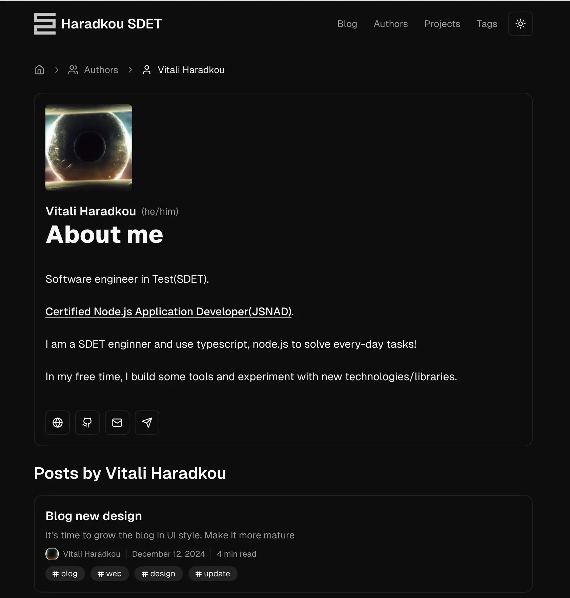
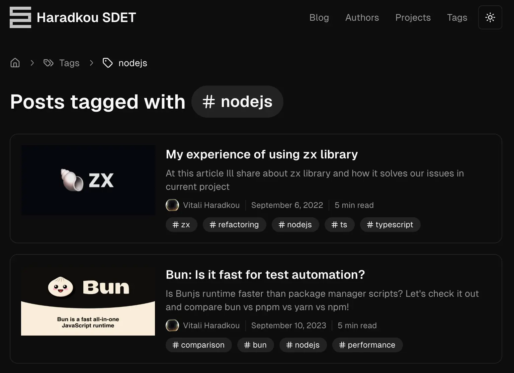

# Context

I like the old blog style, but now it's time to make it more mature. I'll choose to use [shadcn ui](https://ui.shadcn.com/) library, since I like how it looks like.

## What's changed

Let's start with tech stack

| library          |     before      |           after            |
| :--------------- | :-------------: | :------------------------: |
| package manager  |      pnpm       |            pnpm            |
| render library   |      astro      |           astro            |
| library features | view transition | view transition + prefetch |
| CSS library      |    tailwind     |     tailwind + shadcn      |
| analytics        |     google      |          posthog           |
| deployment       |     vercel      |  vercel + github actions   |

New Pages:

- Authors
- Tags

New Features:

- Dark/White themes
- Structured Data
- Markdown lint
- Prefetch
- Telegram instant view (in progress)
- Search (planned, not landed yet)

## Authors page

This page is able to show multimple authors. And you can be an author!



## Tags

This page show all tags across all blog posts



## Features

Let's deep dive into the features!

### Dark/White themes

Because of tailwind - I also dropped theme switching. I hope you'll enjoy this feature same as me!

### Structured data

Structured data is a standardized format for providing information about a page and classifying its content. It helps search engines and other tools understand the content of a webpage better and present it more effectively in search results. It's written in **JSON-LD** format and located inside `<head> </head>` block.

```json title="example.post.json" caption="Example of the Post structured data" showLineNumbers
{
  "@context": "https://schema.org",
  "@type": "WebPage",
  "url": "https://blog-vitaliharadkous-projects.vercel.app/blog/14-redesign",
  "name": "Blog new design",
  "description": "It's time to grow the blog in UI style. Make it more mature",
  "isPartOf": {
    "@type": "WebSite",
    "name": "Haradkou SDET",
    "url": "https://blog-vitaliharadkous-projects.vercel.app/"
  },
  "breadcrumb": {
    "@type": "BreadcrumbList",
    "itemListElement": [
      {
        "@type": "ListItem",
        "position": 1,
        "name": "Home",
        "item": "https://blog-vitaliharadkous-projects.vercel.app/"
      },
      {
        "@type": "ListItem",
        "position": 2,
        "name": "Blog",
        "item": "https://blog-vitaliharadkous-projects.vercel.app/blog"
      },
      {
        "@type": "ListItem",
        "position": 3,
        "name": "Blog new design",
        "item": "https://blog-vitaliharadkous-projects.vercel.app/blog/14-redesign"
      }
    ]
  },
  "datePublished": "2024-12-12T00:00:00.000Z",
  "keywords": ["blog", "web", "design", "update"],
  "author": [
    {
      "@type": "Person",
      "name": "Vitali Haradkou",
      "url": "https://blog-vitaliharadkous-projects.vercel.app/authors/vitalics"
    }
  ]
}
```

```json title="example.tag.json" caption="Example of the tag structured data" showLineNumbers
{
  "@context": "https://schema.org",
  "@type": "CollectionPage",
  "url": "http://localhost:1234/tags/update",
  "name": "update",
  "isPartOf": {
    "@type": "WebSite",
    "url": "https://blog-vitaliharadkous-projects.vercel.app/"
  },
  "breadcrumb": {
    "@type": "BreadcrumbList",
    "itemListElement": [
      {
        "@type": "ListItem",
        "position": 1,
        "name": "Home",
        "item": "https://blog-vitaliharadkous-projects.vercel.app/"
      },
      {
        "@type": "ListItem",
        "position": 2,
        "name": "Tags",
        "item": "https://blog-vitaliharadkous-projects.vercel.app/tags"
      },
      {
        "@type": "ListItem",
        "position": 3,
        "name": "update",
        "item": "https://blog-vitaliharadkous-projects.vercel.app/tags/update"
      }
    ]
  },
  "about": {
    "@type": "DefinedTerm",
    "name": "update",
    "url": "https://blog-vitaliharadkous-projects.vercel.app/tags/update"
  },
  "hasPart": [
    {
      "@type": "BlogPosting",
      "headline": "@rslike/cmp: compare your structures like a pro",
      "url": "https://blog-vitaliharadkous-projects.vercel.app/posts/07-rslike-cmp",
      "datePublished": "2023-08-23T00:00:00.000Z",
      "author": [
        {
          "@type": "Person",
          "name": "Vitali Haradkou",
          "url": "https://blog-vitaliharadkous-projects.vercel.app/authors/vitalics"
        }
      ]
    }
    // rest blog posts
  ]
}
```

```json title="author.json" caption="Example of the author structured data" showLineNumbers
{
  "@context": "https://schema.org",
  "@type": "Person",
  "name": "Vitali Haradkou",
  "image": "https://avatars.githubusercontent.com/u/8816260?v=4",
  "email": "vitalicset@gmail.com",
  "url": "https://blog-vitaliharadkous-projects.vercel.app",
  "sameAs": [
    "https://blog-vitaliharadkous-projects.vercel.app",
    "https://github.com/vitalics",
    "https://t.me/vitalicset"
  ]
}
```

Of course, you are able to see tag, blog and author collections by `/blog`, `/tags` and `/authors` urls. You can find blog example below. Rest collection mostly similar.

```json title="blog-collection.json" caption="Example of the blog collection" showLineNumbers
{
  "@context": "https://schema.org",
  "@type": "CollectionPage",
  "url": "https://blog-vitaliharadkous-projects.vercel.app/blog",
  "name": "Blog",
  "description": "Blog",
  "isPartOf": {
    "@type": "WebSite",
    "url": "http://localhost:1234/blog"
  },
  "breadcrumb": {
    "@type": "BreadcrumbList",
    "itemListElement": [
      {
        "@type": "ListItem",
        "position": 1,
        "name": "Home",
        "item": "https://blog-vitaliharadkous-projects.vercel.app/"
      },
      {
        "@type": "ListItem",
        "position": 2,
        "name": "Blog",
        "item": "https://blog-vitaliharadkous-projects.vercel.app/blog"
      },
      {
        "@type": "ListItem",
        "position": 3,
        "name": "Page 1",
        "item": "https://blog-vitaliharadkous-projects.vercel.app/blog"
      }
    ]
  },
  "hasPart": [
    {
      "@type": "BlogPosting",
      "headline": "Blog new design",
      "url": "https://blog-vitaliharadkous-projects.vercel.app/14-redesign",
      "datePublished": "2024-12-12T00:00:00.000Z",
      "author": [
        {
          "@type": "Person",
          "name": "Vitali Haradkou",
          "url": "https://blog-vitaliharadkous-projects.vercel.app/authors/vitalics"
        }
      ],
      "keywords": ["blog", "web", "design", "update"],
      "description": "It's time to grow the blog in UI style. Make it more mature"
    }
    // rest blog posts
  ]
}
```

### Markdown lint

Since all blog posts located in github - I add markdownlint check to ensure that your blog post is OK.

### Prefetch

The [Astro Prefetch](https://docs.astro.build/en/guides/prefetch/) feature is part of the Astro web framework, designed to optimize user experience by preloading resources for faster navigation. It anticipates which links users are likely to click next and preloads the relevant content in the background.

### Telegram instant view

Telegram have a nice feature - [instant view](https://instantview.telegram.org/). With an examples how to build instant views for your sites.

Due to caching nature of the telegram instant view - this feature will be dropped a few weeks after this blog post shipped 🚀.

### Search

Not shipped now. Stay turned and watch the updates!

## Is it all?

No! I have a few more secret features that will be shipped next year. I hope you will see soon.

## Stay tuned!
