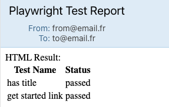

Recently, I received a request from one of the project leads about integrating with Email. Since the email report was generated by a playwright written using React. That means we cannot send the same HTML report due to the interactive behavior of the built-in HTML reporter.

## Requirements

1. Select when the report should be sent
2. `Subject` and `body` should be written in code.
3. Support many email services out of the box

Nice to have:

1. Generate an ICS meeting in case of a failed test due to the scheduled run.

So I started to investigate the solution and found that existing reports do not cover our needs. That starting point - time to tinkering!


> How do I see myself when solving problems and tinkering

First of all, I take [`nodemailer`](https://nodemailer.com/) as a dependency to send an email and check it.

After all, I was trying to add interfaces. Inspect the [playwright built-in HTML reporter](https://playwright.dev/docs/test-reporters#html-reporter) about settings and env variables. As for initial implementation, I was taking only the `send` setting with the same args: `never`, `always` and `on-failure`. Other settings like `from`, `to`, `service` reuse from `nodemailer` dependency and add env var support with predefined values like `send` (send default value is `on-failure`).

So let's check out how it works.

### Step 1. Installation

just add dependency `playwright-nodemailer-reporter` via any package manager:

```sh
npm i playwright-nodemailer-reporter # for npm
pnpm i playwright-nodemailer-reporter # for pnpm
yarn add playwright-nodemailer-reporter # for yarn
```

### Step 2. playwright config

At this step, we have to add a reporter for Playwright. You can do it in the `playwright.config.ts` file

```ts
// filename: playwright.config.ts
import { defineConfig } from "@playwright/test";
import { type NodemailerReporterOptions } from "playwright-nodemailer-reporter";

export default defineConfig({
  reporter: [
    [
      "playwright-nodemailer-reporter",
      {
        send: 'always',
        from: "your-email@example.com",
        to: "recipient-email@example.com",
        subject: "Playwright Test Report",
        html: "<p>Test report</p>", # what will be send
      } satisfies EmailReporterOptions,
    ],
  ],
});

```

### Step 3. Dynamic message

The next step was to make the message and subject dynamically generated. This is essential for the customer because we save a ton of time with building up the string. Moreover, `subject`, `html` and `text` keys support async function to call any of your external functions or async functions.

```ts
import { defineConfig } from '@playwright/test'
import { type NodemailerReporterOptions } from 'playwright-nodemailer-reporter'

export default defineConfig({
  reporter: [
    [
      'playwright-nodemailer-reporter',
      {
        send: 'always',
        service: 'Maildev',
        port: 1025,
        from: 'from@email.fr',
        to: 'to@email.fr',
        subject: 'Playwright Test Report',
        html: (result, testCases) => {
          return `
          HTML Result:
          <table>
            <tr>
              <th>Test Name</th>
              <th>Status</th>
            </tr>
            ${testCases
              .map(
                ([testCase, result]) => `
              <tr>
                <td>${testCase.title}</td>
                <td>${result.status}</td>
              </tr>
            `,
              )
              .join('')}
          </table>
          `
        },
      } satisfies NodemailerReporterOptions,
    ],
  ],
})
```

In this example, we build a table with the test case name and its result.

The rendered result will be something like this:



You can also add [`Gmail`](https://nodemailer.com/usage/using-gmail) or other popular services since the reporter just reused `nodemailer`.

### Step 4. You are awesome!

Check it out on npm: https://www.npmjs.com/package/playwright-nodemailer-reporter
Check it out on GitHub: https://github.com/vitalics/playwright-nodemailer-reporter

P.S. I was faced with an issue when `playwright-email-reporter` and `playwright-mail-reporter` already existed, so I renamed the package, but the naming can be inconsistent with the package name. I'll try to fix it in the next release.

P.P.S. Check the other cool packages for everyday usage

- [Playwright promehteus remote write reporter](https://github.com/vitalics/playwright-prometheus-remote-write-reporter)
- [Playwright CPUPro reporter](https://github.com/vitalics/playwright-cpupro-reporter)
- [Playwright Angular Selectors](https://github.com/vitalics/playwright-angular-selectors)
- [ajv-ts](https://github.com/vitalics/ajv-ts)
- [rslike](https://github.com/vitalics/rslike). Rust-like safe approach for JS/TS code

Thanks for the reading and have a good time!
Made with ❤️ from Vitali!
